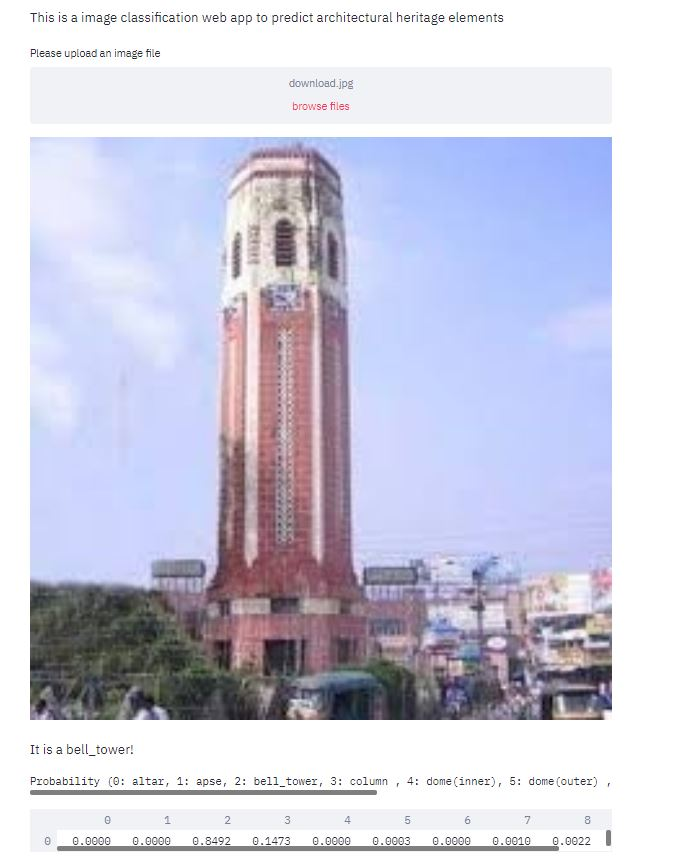
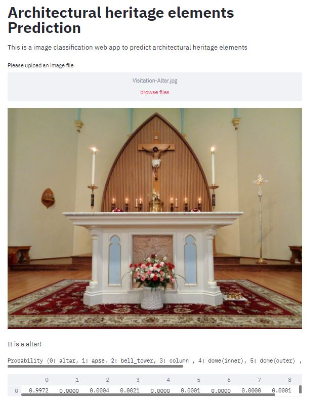

# Architectural-Heritage-Elements-Prediction

#### Architectural Heritage Elements Dataset (AHE) is an image dataset for developing deep learning algorithms and specific techniques in the classification of architectural heritage images. This dataset consists of 10235 images classified in 10 categories: Altar: 829 images; Apse: 514 images; Bell tower: 1059 images; Column: 1919 images; Dome (inner): 616 images; Dome (outer): 1177 images; Flying buttress: 407 images; Gargoyle (and Chimera): 1571 images; Stained glass: 1033 images; Vault: 1110 images. It is inspired by the CIFAR-10 dataset but with the objective in mind of developing tools that facilitate the tasks of classifying images in the field of cultural heritage documentation. Most of the images have been obtained from Flickr and Wikimedia Commons (all of them under creative commons license).

#### This Repo contains the end to end implementation of this project 
#### The model is made using transfer learning
#### Webapp interface is made using streamlit

#### The dataset can be found here: https://old.datahub.io/organization/architectural_heritage_elements_image_dataset

#### Below are the results:

    

    

    

